# Flip Light+

> 흑과 백, 빛과 어둠의 **대비(Contrast)** 를 소재로 한 2D 탑다운 생존 액션 게임

<p align="center">
  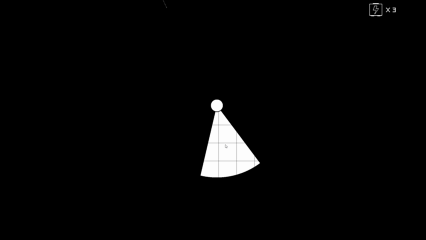
</p>

플레이어는 검은 배경 속에서 손전등을 사용해 적을 멈추게 하거나 피하며, **발전기에 빛을 충전해 문을 여는 것**이 목표입니다. 맵 곳곳에 숨겨진 **반전 아이템**을 획득하면 세계가 흑에서 백으로 뒤집히며, 적은 일시적으로 멈추고 플레이어는 손전등으로 적을 제거할 수 있게 됩니다. "빛과 어둠의 대비"에서 오는 긴장과 해방감이 게임의 핵심 경험입니다.

이 저장소는 Unity 게임잼 프로젝트 **Week5GameJam**(팀명: W05_A반_1조)의 후속작으로, 발전기 게이지 시스템·체력=손전등 범위 시스템·튜토리얼·신규 적 등을 추가로 개발한 확장판 **Flip Light+** 입니다.

## 목차

- [게임 개요](#게임-개요)
- [핵심 컨셉](#핵심-컨셉)
- [코어 루프 & 조작법](#코어-루프--조작법)
- [Flip Light+에서 달라진 점](#flip-light에서-달라진-점)
- [게임 요소](#게임-요소)
- [추가 스크린샷](#추가-스크린샷)
- [개발 환경](#개발-환경)
- [프로젝트 구조](#프로젝트-구조)
- [팀](#팀)
- [제작 회고](#제작-회고)

## 게임 개요

| 항목 | 내용 |
| --- | --- |
| 타이틀 | Flip Light (테마: Contrast) |
| 장르 | 2D 탑다운 생존 / 캐주얼 액션 |
| 엔진 | Unity 6 (`6000.2.6f2`), URP 2D |
| 핵심 키워드 | 흑과 백, 손전등, 전환 |
| 플랫폼 | PC |

## 핵심 컨셉

### 세계의 대비

같은 손전등 빛이라도 세계 상태(`WorldStateManager`의 반전 여부)에 따라 완전히 다르게 작동합니다.

<table>
<tr>
<th align="center">Normal (Black)</th>
<th align="center">Inverted (White)</th>
</tr>
<tr>
<td align="center">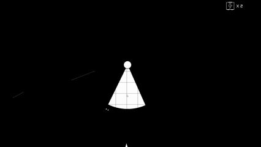</td>
<td align="center">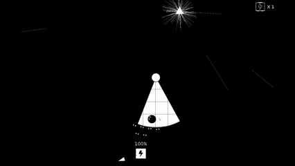</td>
</tr>
<tr>
<td>배경 검정 / 손전등 흰색. 시야가 매우 제한되며, 어둠과 검은 벽을 헤쳐가며 발전기를 충전해야 합니다.</td>
<td>배경 흰색 / 손전등 검정. 이동 속도가 일시적으로 상승하고, 반전된 손전등 빛을 받은 적은 제거됩니다.</td>
</tr>
</table>

### 핵심 경험

- **불안과 긴장**: 검은 화면 속에서 시야가 제한된 상태로 긴장감을 느낍니다.
- **전환의 카타르시스**: 반전 아이템 획득 시 흑백이 뒤집히며 게임 흐름이 달라지는 짜릿함을 줍니다.

## 코어 루프 & 조작법

1. 스테이지 진입 → 적이 플레이어를 인식하고 추적 시작
2. 손전등으로 위험 제어 (`Normal` = Stun / `Inverted` = Kill)
3. 적에게 피격 시 손전등 범위 축소, 네모 아이템 획득 시 범위 확대
4. 반전 아이템 확보 시 세계 반전
5. 발전기를 모두 충전 → 문(출구) 개방

| 입력 | 동작 |
| --- | --- |
| `W` `A` `S` `D` | 이동 |
| 마우스 | 손전등(빛) 방향 조작 |
| 상호작용 | 아이템 획득 / 발전기 충전 / 탈출구 도달 |

<p align="center">
  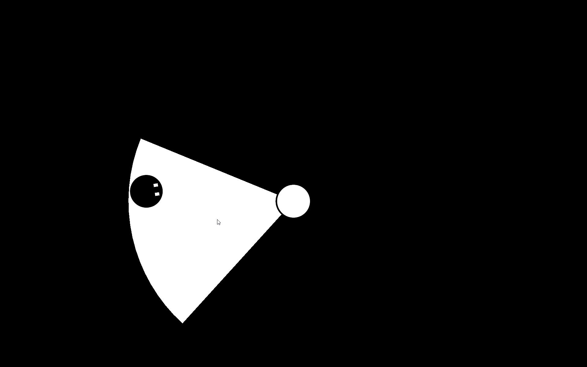
</p>

## Flip Light+에서 달라진 점

게임잼 원작 대비 아래 항목들을 새로 설계·구현했습니다.

### 1. 맵 및 구조 개선

| 기존 | 개선 |
| --- | --- |
| 단색 배경이라 이동감을 체감하기 어려움 | 타일 패턴을 추가해 이동감 향상 |
| 무한히 이어지는 맵 | 맵 외곽에 벽을 배치한 제한된 맵 구조로 목표 지점을 인식하기 쉽게 개선 |
| 열쇠 수집 중심 | 빛 에너지를 채집하는 **발전기** 구조물로 대체. 지속적으로 빛을 비추면 게이지가 채워지고 출구가 열림 |

<p align="center">
  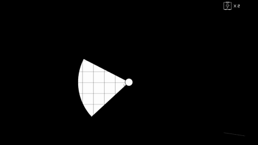
</p>

맵 중앙에는 출구(문)를, 맵 전역에는 발전기를 배치해 탐험을 유도하고, 발전기 주변에는 벽 오브젝트를 특정 패턴으로 배치해 다양한 이동·액션을 유도했습니다. 또한 발전기 충전 방법, 문이 열리는 조건, 네모/반전 아이템 등 핵심 메카닉을 익힐 수 있도록 **튜토리얼**을 추가했습니다.

<p align="center">
  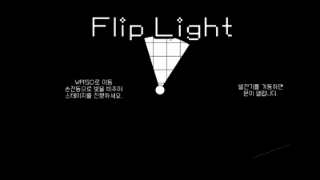
</p>

### 2. 시스템 및 시각적 피드백 개선

| 기존 | 개선 |
| --- | --- |
| 한 번의 피격으로 즉사 | 배터리 UI로 남은 체력(손전등 범위)을 표시하는 체력 시스템으로 변경 |
| 죽으면 바로 게임 오버 | 죽음 애니메이션을 추가해 사망에 대한 피드백 제공 |
| 인디케이터가 어떤 오브젝트(열쇠/출구/아이템)를 가리키는지 알 수 없음 | 가장 가까운 발전기 방향으로 핑(ping)을 직선적으로 표시하는 발전기 인디케이터로 변경 |
| 발전기에 빛을 쏴도 충전 여부를 알기 어려움 | 충전 중/완료 시 명확한 피드백 제공 + 스테이지별 필요 발전기 개수와 적 특징을 안내하는 온보딩 UI 추가 |

피격 시 라이프가 아닌 **손전등 범위**가 줄어드는 방식으로 체력을 표현해 UI 정보를 최소화하면서도 메카닉에 맞는 피드백을 제공합니다.

<p align="center">
  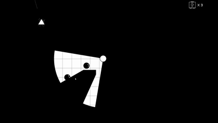
  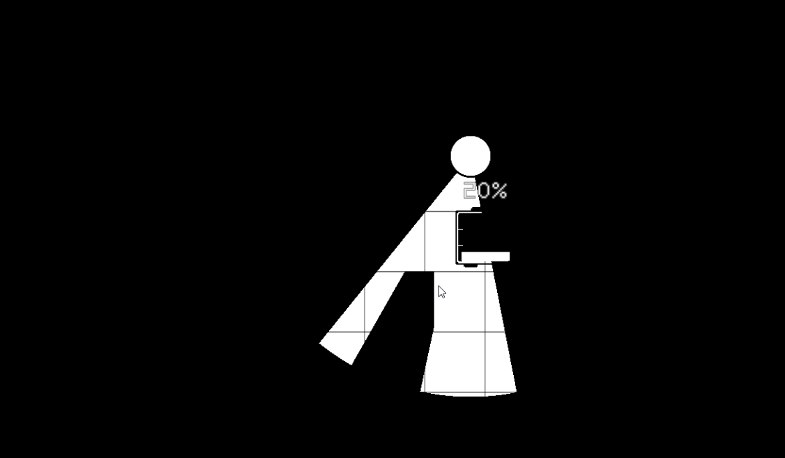
</p>

발전기 인디케이터와 충전 피드백은 기존 대비 다음과 같이 개선되었습니다.

<table>
<tr><th align="center">기존</th><th align="center">개선</th></tr>
<tr>
<td align="center">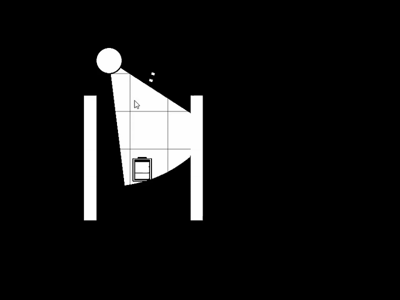</td>
<td align="center">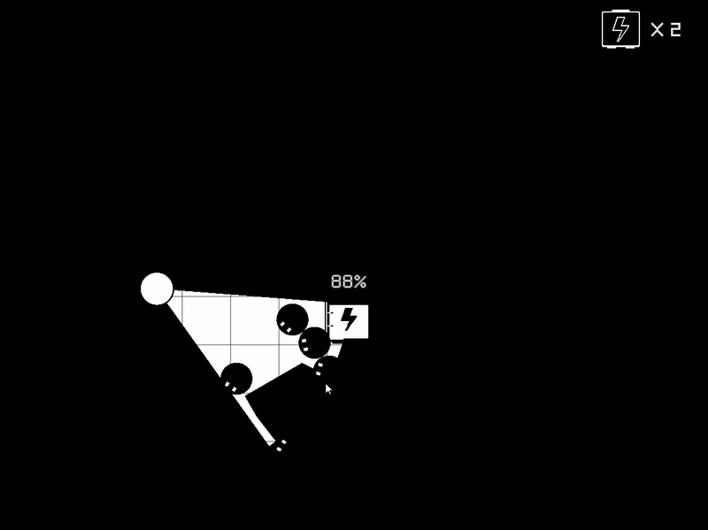</td>
</tr>
<tr>
<td align="center">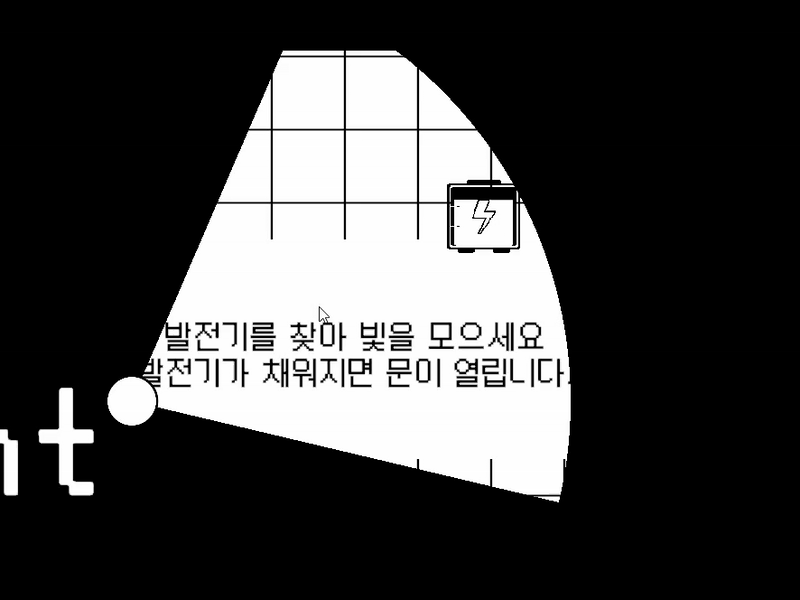</td>
<td align="center">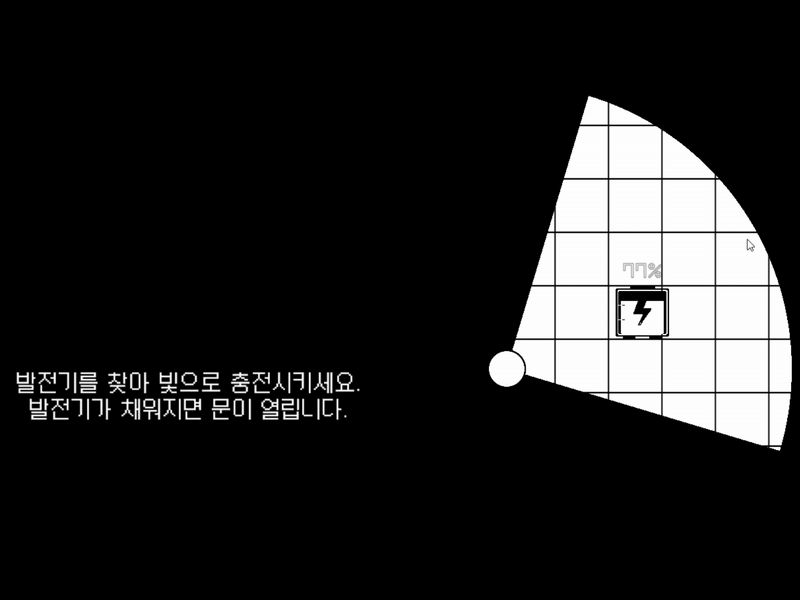</td>
</tr>
</table>

스테이지 온보딩 UI는 진입 시 목표(충전할 발전기 개수)와 등장하는 적의 특징을 안내합니다.

<table>
<tr>
<td align="center">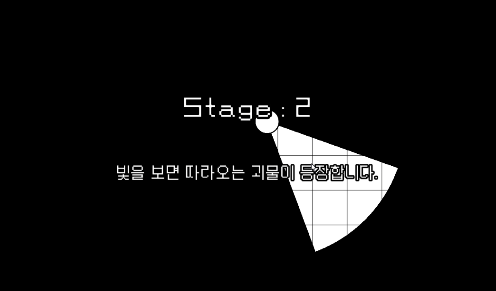</td>
<td align="center">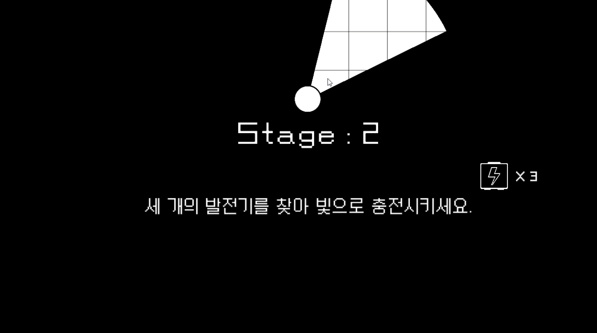</td>
</tr>
</table>

사망 시에는 즉시 게임 오버로 넘어가지 않고 죽음 애니메이션으로 피드백을 제공합니다.

<p align="center">
  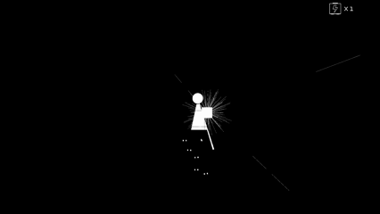
</p>

### 3. 적 및 밸런스 개선

빛을 미끼로 활용하는 신규 적 **아귀 몬스터**를 추가했습니다. 일반 몬스터보다 3배 크고, 감지 시 플레이어 방향으로 일직선으로 빠르게 돌진합니다(`AgwiEnemy.cs`). 이 외에도 전체 적의 속도·배치·아이템 수량을 재조정해 난이도 밸런스를 조정했습니다.

<p align="center">
  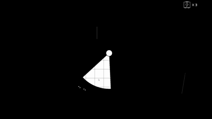
</p>

## 게임 요소

### 적

| 종류 | 스크립트 | 특징 |
| --- | --- | --- |
| 일반 적 | `NormalEnemy` | 어둠 속에서 플레이어를 향해 접근, 빛에 닿으면 정지 |
| 라이트시커 적 | `LightSeekerEnemy` | 손전등에 노출되면 속도가 점점 빨라지며 접근 |
| 아귀 몬스터 | `AgwiEnemy` | Sleep → Wake → Rush 상태로 전환되는 매복형 적. 감지 시 플레이어를 향해 빠르게 돌진 |
| 뱀형 적 | `SnakeMonster` | 조준 후 돌진(Charge)하는 다분절 몸체의 적 |

모든 적은 `BaseEnemy`를 상속하며, 이동/회전/시야 노출/디스폰/사망 연출을 담당하는 모듈(`EnemyMovement`, `EnemyRotation`, `EnemyVisibility` 등)로 구성되어 있습니다.

### 아이템

- **반전 아이템**: 획득 시 일정 시간 세계가 반전됩니다 (`InvertPickup`, `WorldStateManager`).
- **네모(사각형) 아이템**: 손전등 범위를 넓혀줍니다 (`RectanglePickup`).
- **생명 회복 아이템**: 최대치 내에서 목숨을 회복시킵니다 (`LifeupPickup`).

### 발전기 / 게이지 시스템

맵에 배치된 발전기(`LightGaugeSystem`)에 손전등 빛을 지속적으로 비추면 게이지가 채워집니다. 모든 발전기를 충전하면 `GeneratorManager`가 이를 감지해 `ExitDoorController`를 통해 탈출구를 개방합니다.

## 추가 스크린샷

<table>
<tr>
<td align="center">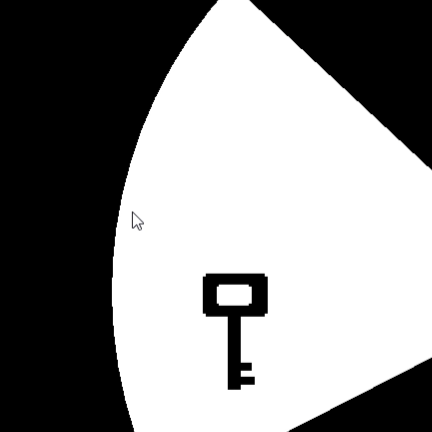<br>손전등으로 비춰야 보이는 오브젝트 예시</td>
<td align="center">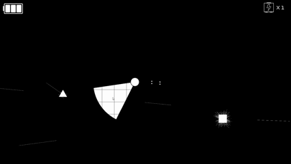<br>플레이 데모</td>
</tr>
<tr>
<td align="center">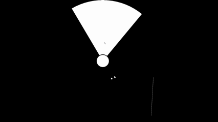<br>플레이 데모</td>
<td align="center">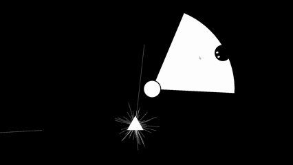<br>플레이 데모</td>
</tr>
</table>

## 개발 환경

- **엔진**: Unity `6000.2.6f2`
- **렌더 파이프라인**: Universal Render Pipeline (2D)
- **주요 패키지**: `com.unity.inputsystem`, `com.unity.ai.navigation`(NavMesh), `com.h8man.2d.navmeshplus`, `com.unity.2d.tilemap`, `com.unity.2d.animation`, `com.unity.timeline`, TextMesh Pro

### 실행 방법

1. [Unity Hub](https://unity.com/download)에서 `6000.2.6f2` 이상의 에디터를 설치합니다.
2. 저장소를 클론한 뒤 Unity Hub에서 프로젝트 폴더를 엽니다.
3. `Assets/Scenes` 하위의 씬(타이틀 또는 스테이지 씬)을 열어 재생합니다.

## 프로젝트 구조

```
Assets/
├── Prefabs/          # 플레이어, 적, 발전기, 아이템, UI 등 프리팹
├── Resources/         # 스프라이트, 애니메이션 리소스
├── Scenes/             # 타이틀 및 스테이지 씬
├── Scripts/
│   ├── Battery/        # 발전기 게이지 시스템
│   ├── Camera/          # 카메라 추적/배경
│   ├── Enemy/            # 적 AI (공통 모듈 + 개별 타입, 아귀 몬스터 포함)
│   ├── Exit/              # 탈출구 / 발전기 매니저 / 인디케이터
│   ├── Flashlight/         # 손전등 시야/반전 로직
│   ├── Item/                # 아이템 및 색상 반전 처리
│   ├── Manager/               # GameManager, SceneManager
│   ├── Map/                    # 내비메시 베이킹
│   ├── Player/                  # 이동, 생명(손전등 범위), 접촉 처리
│   ├── Spawner/                   # 적/지형 스포너
│   ├── StateManager/               # WorldStateManager (반전 상태 관리)
│   ├── UI/                          # HUD, 온보딩 UI 등
│   └── Wall/                         # 장애물/시야 차단 처리
└── SO/                # ScriptableObject 기반 설정 데이터
```

## 팀

오상협, 이정민, 조지은, 최주영

## 제작 회고

**잘된 점**

- "Contrast(대비)"라는 주제에 맞는 컨셉과 메카닉을 구현했습니다.
- 배경이 흑백뿐이라 이동감을 주기 어려웠던 문제를, 타일맵 추가와 카메라 범위 확장으로 해결했습니다.
- 미니멀한 스프라이트와 UI만으로 규칙을 전달하기 위해 발전기 충전 효과, 스테이지 UI, 튜토리얼을 구현했습니다.
- 여러 차례의 플레이테스트를 통해 적절한 난이도로 조정했습니다.

**어려웠던 점**

- 빛과 어둠만을 활용하는 게임 특성상 흑백만으로 UI/UX를 제작하는 데 제약이 컸습니다.

**아쉬운 점**

- 셰이더 등을 활용해 빛이 닿은 벽 표면에 질감 테두리를 표현하려 했으나, 기존 손전등 코드와 연결하는 방법을 찾지 못해 구현에 실패했습니다.

**Known Issues**

- 몬스터에게 피격당하면 잠깐 동안 몬스터가 플레이어를 밀어내는 현상이 있습니다.
